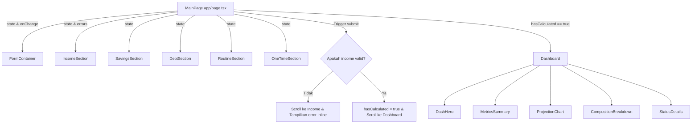

# Spesifikasi Komponen React: Qimey ("Slip")

Dokumen ini mendefinisikan arsitektur komponen, tipe data, dan aliran data (_state flow_) untuk aplikasi Qimey.

---

## 1. Struktur Folder Proyek

Proyek akan menggunakan Next.js App Router standar dengan struktur modular berikut:

```
qimey/
├── app/
│   ├── layout.tsx         # Layout utama, konfigurasi font, dan metadata SEO
│   ├── page.tsx           # Halaman utama (koordinator state dan localStorage)
│   └── globals.css        # Gaya global Tailwind CSS & variabel CSS custom
├── components/
│   ├── FormContainer.tsx  # Wrapper formulir input (langkah 1-5)
│   ├── IncomeSection.tsx  # Formulir input pendapatan & potongan pajak
│   ├── SavingsSection.tsx # Formulir input tabungan saat ini
│   ├── DebtSection.tsx    # Formulir input cicilan & utang
│   ├── RoutineSection.tsx # Formulir input pengeluaran rutin
│   ├── OneTimeSection.tsx # Formulir input pengeluaran sekali bayar
│   ├── Dashboard.tsx      # Penampung hasil perhitungan (ditampilkan di bawah form)
│   ├── DashHero.tsx       # Tampilan utama saldo akhir Desember
│   ├── MetricsSummary.tsx # Matrik ringkasan (pendapatan bersih, cicilan ratio, dll)
│   ├── ProjectionChart.tsx# Grafik batang proyeksi bulanan (Recharts)
│   └── CompositionBreakdown.tsx # Breakdown pengeluaran bulan berjalan
├── types/
│   └── finance.ts         # Definisi interface TypeScript global
└── utils/
    └── finance.ts         # Mesin kalkulasi proyeksi keuangan
```

---

## 2. Model Data & Tipe (TypeScript)

Tipe data yang didefinisikan dalam `types/finance.ts` mengadopsi model data dari PRD:

```typescript
export type Periode = "harian" | "mingguan" | "bulanan" | "tahunan";
export type JenisPotongan = "persen" | "nominal";

export interface Pajak {
  id: string;
  nama: string;
  jenis: JenisPotongan;
  nilai: number;
}

export interface Income {
  id: string;
  nama: string;
  nominal: number;
  periode: Periode;
  masaBulan: number | null; // null = tanpa batas
  pajak: Pajak[];
}

export interface Tabungan {
  saldoSaatIni: number;
  include: boolean;
}

export interface ItemBerkala {
  id: string;
  nama: string;
  nominal: number;
  periode: Periode;
  masaBulan: number;
}

export interface PengeluaranRutin {
  id: string;
  title: string;
  nominal: number;
  periode: "harian" | "mingguan" | "bulanan";
}

export interface PengeluaranSekaliBayar {
  id: string;
  title: string;
  nominal: number;
  bulanKejadian: number; // 0-11 (index bulan JS: 0 = Januari, 1 = Februari, dst. Disesuaikan dengan bulan berjalan)
}

export interface FinancialState {
  incomes: Income[];
  tabungan: Tabungan;
  cicilanUtang: ItemBerkala[];
  pengeluaranRutin: PengeluaranRutin[];
  pengeluaranSekaliBayar: PengeluaranSekaliBayar[];
}

export interface MonthlyProjection {
  bulanIndex: number; // 0-11
  bulanNama: string; // Contoh: "Jun", "Jul"
  tahun: number; // Contoh: 2026
  pendapatanKotor: number;
  pajakPotongan: number;
  pendapatanBersih: number;
  cicilanUtang: number;
  pengeluaranRutin: number;
  pengeluaranSekaliBayar: number;
  cashflow: number;
  saldo: number;
  defisitWarning: boolean;
  lunasCicilanIds: string[]; // ID cicilan yang lunas di bulan ini
  berakhirIncomeIds: string[]; // ID income yang berakhir di bulan ini
}
```

---

## 3. Komponen Halaman & Layout

### `RootLayout` (`app/layout.tsx`)

- **Tanggung Jawab:** Menginisialisasi HTML, menyetel font (Inter dari Google Fonts), dan mendefinisikan metadata SEO dasar.
- **Tipe:** Server Component.

### `MainPage` (`app/page.tsx`)

- **Tanggung Jawab:** Menyimpan state utama `FinancialState`, sinkronisasi otomatis dengan `localStorage`, memicu validasi, serta merender `FormContainer` dan `Dashboard` secara vertikal di bawahnya jika kalkulasi sudah dipicu.
- **Tipe:** Client Component (`'use client'`).
- **State Utama:**
  - `financialState` (`FinancialState`): Menampung seluruh input form.
  - `hasCalculated` (`boolean`): Menandakan apakah hasil dashboard harus ditampilkan di bawah form.
  - `currentMonthIndex` (`number`): Index bulan saat ini berdasarkan sistem waktu lokal (untuk memulai proyeksi s/d Desember).
  - `currentYear` (`number`): Tahun berjalan.
  - `errors` (`Record<string, string>`): Menyimpan error validasi income.

---

## 4. Komponen Input Formulir (Form)

### `FormContainer` (`components/FormContainer.tsx`)

- **Tanggung Jawab:** Membungkus seluruh section input form dari langkah 1-5 dan tombol submit.
- **Props:**
  ```typescript
  interface Props {
    state: FinancialState;
    onChange: (newState: FinancialState) => void;
    onSubmit: () => void;
    errors: Record<string, string>;
  }
  ```

### `IncomeSection` (`components/IncomeSection.tsx`)

- **Tanggung Jawab:** Mengelola masukan pendapatan. Setiap item pendapatan dirender dalam kartu terpisah dengan opsi tombol "Potongan Pajak" untuk menambah baris potongan pajak spesifik pada income bersangkutan.
- **State Internal:** `expandedTaxIncomeId` (string | null) untuk mencatat kartu income mana yang sedang dikonfigurasi pajaknya.

### `SavingsSection` (`components/SavingsSection.tsx`)

- **Tanggung Jawab:** Memasukkan saldo tabungan saat ini dan beralih antara menyertakan atau mengecualikan saldo ini dalam proyeksi.

### `DebtSection` (`components/DebtSection.tsx`)

- **Tanggung Jawab:** Menampung daftar cicilan dan utang dengan masa tenor bulan yang wajib diisi.

### `RoutineSection` (`components/RoutineSection.tsx`)

- **Tanggung Jawab:** Menampung daftar pengeluaran rutin bulanan/mingguan/harian tanpa masa berakhir.

### `OneTimeSection` (`components/OneTimeSection.tsx`)

- **Tanggung Jawab:** Menampung daftar pengeluaran satu kali bayar pada bulan spesifik (dropdown bulan berjalan s/d Desember).

---

## 5. Komponen Dashboard Hasil (Dashboard)

_Komponen ini hanya dirender di bawah formulir input setelah tombol "Hitung Proyeksi" ditekan._

### `Dashboard` (`components/Dashboard.tsx`)

- **Tanggung Jawab:** Penampung utama dashboard hasil proyeksi keuangan. Menerima data proyeksi hasil komputasi dan menyusun komponen grafik, ringkasan metrik, komposisi bulanan, dan list info pelunasan di bagian bawah.
- **Props:**
  ```typescript
  interface Props {
    projection: MonthlyProjection[];
    state: FinancialState;
    startMonthName: string;
    startYear: number;
  }
  ```

### `DashHero` (`components/DashHero.tsx`)

- **Tanggung Jawab:** Menampilkan saldo kumulatif proyeksi akhir Desember dengan angka besar yang menonjol dan catatan asumsi perhitungan bulan berjalan.

### `MetricsSummary` (`components/MetricsSummary.tsx`)

- **Tanggung Jawab:** Menampilkan metrik ringkasan dalam grid 4 kolom:
  1. Total Pendapatan Bersih (Juni-Desember).
  2. Total Pajak & Potongan.
  3. Total Cicilan & Utang.
  4. Rasio Cicilan terhadap Pendapatan Bersih (bulan berjalan).

### `ProjectionChart` (`components/ProjectionChart.tsx`)

- **Tanggung Jawab:** Merender grafik batang horizontal/vertikal interaktif yang menggambarkan perubahan saldo dari bulan berjalan s/d Desember menggunakan Recharts.
- **Kunci Visual:** Warna hijau untuk saldo positif, merah untuk defisit saldo (< 0). Menggunakan `ssr: false` via `next/dynamic` untuk mencegah kesalahan hidrasi server.

### `CompositionBreakdown` (`components/CompositionBreakdown.tsx`)

- **Tanggung Jawab:** Menampilkan komposisi pengeluaran dan sisa uang untuk bulan berjalan dalam bentuk progress bars/stacked progress bar harmonis (Pajak vs Cicilan vs Rutin vs Sisa).

### `StatusDetails` (`components/StatusDetails.tsx`)

- **Tanggung Jawab:** Menampilkan daftar pelunasan cicilan ("lunas [Bulan]") dan pemberitahuan berakhirnya income tertentu.
- **Penting:** Sesuai permintaan pengguna, badge lunas dan detail status cicilan/income ini _hanya_ ditampilkan pada bagian hasil kalkulasi ini, bukan di form input utama.

---

## 6. Aliran State & Logika Reaktivitas



1. **Auto-save ke LocalStorage:** Setiap kali state `financialState` di `MainPage` berubah, useEffect dipicu untuk menyimpan state dalam format JSON ke dalam key `fyvian_financial_state`.
2. **Kalkulasi Dinamis:** Perhitungan proyeksi dilakukan secara instan ketika state disubmit dan `hasCalculated` bernilai true. Perubahan input formulir setelah hitungan pertama akan langsung memperbarui dashboard secara otomatis jika `hasCalculated` aktif.
3. **Penyelarasan Bulan Berjalan:** Aplikasi akan mendeteksi waktu browser saat ini, menentukan index bulan berjalan (misal Juni = index 5), dan menghitung proyeksi dengan rentang dinamis `index_bulan_berjalan` hingga `11` (Desember).
